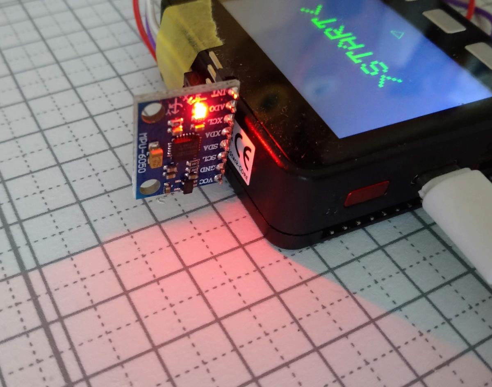
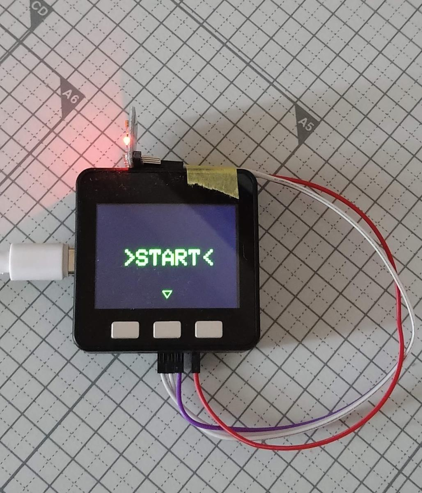
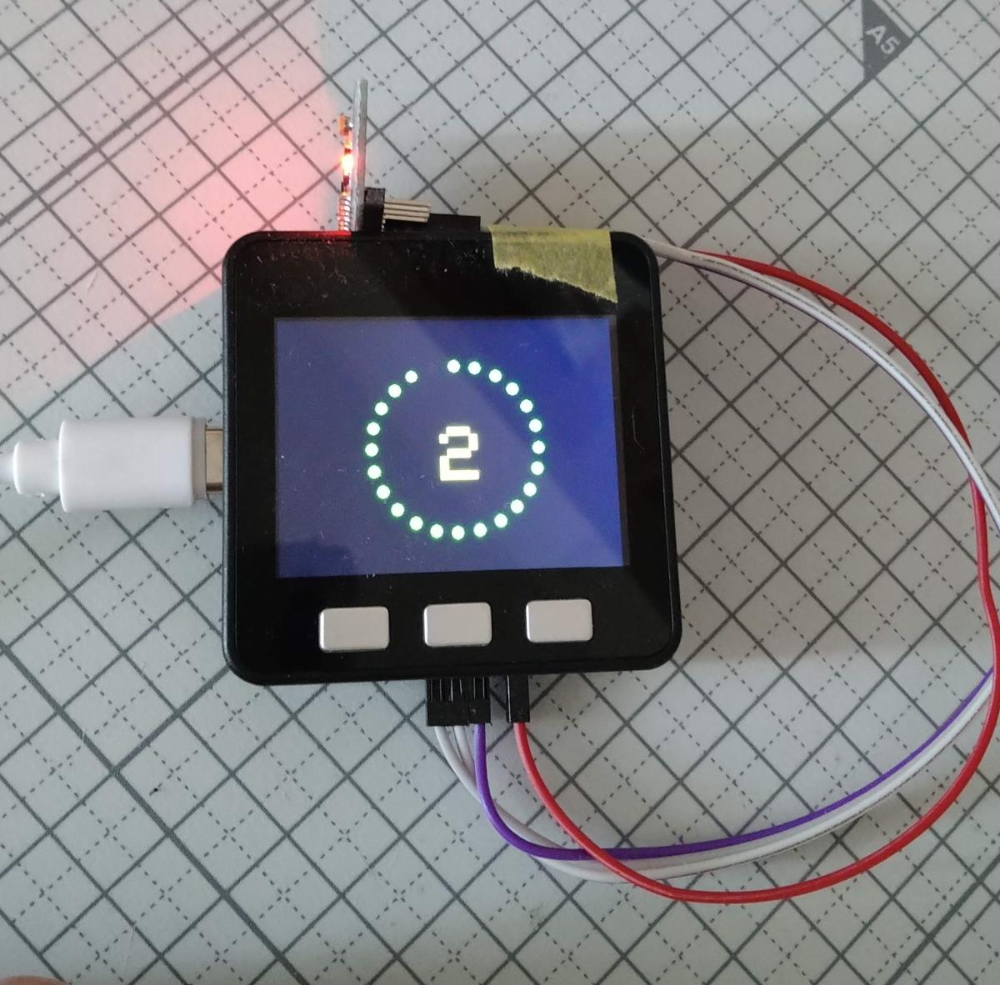
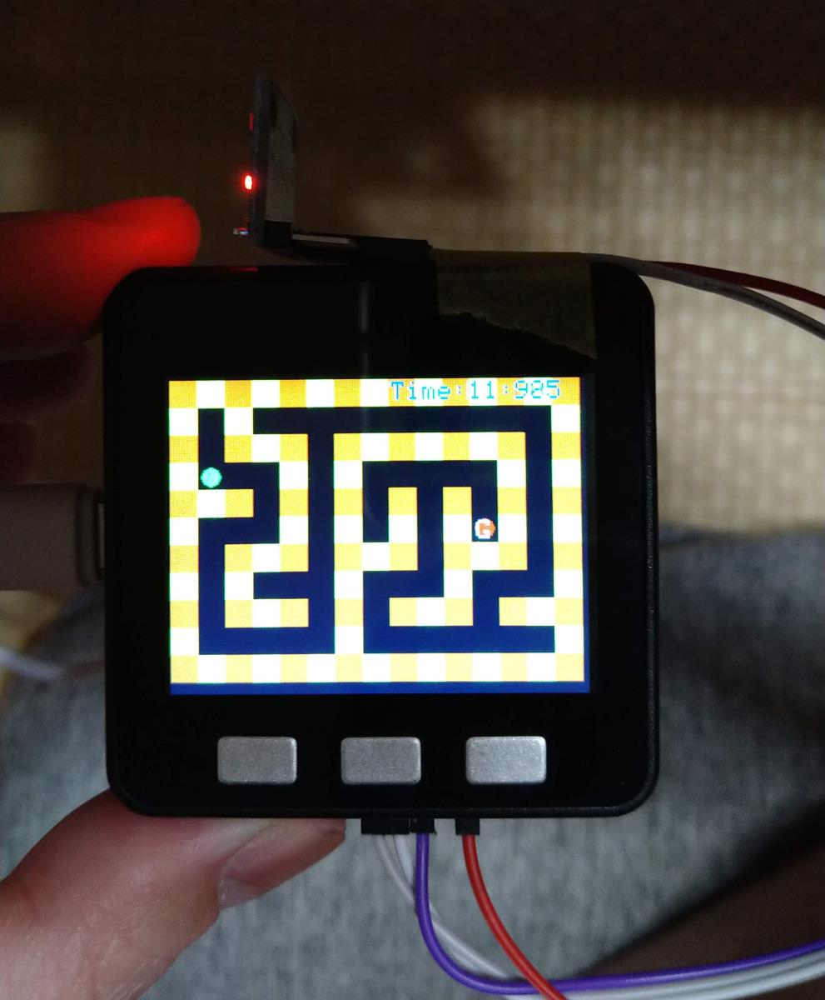
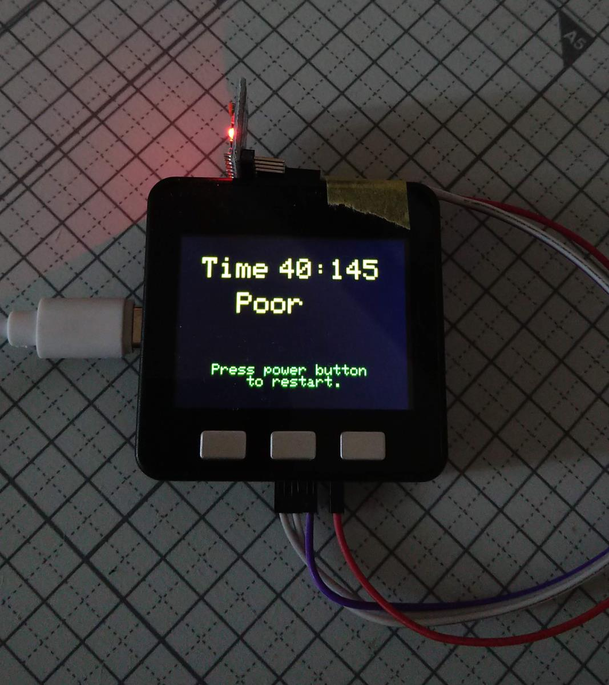

# Korokoro

## 概要 (Overview)

M5Stackと3軸加速度センサを用いた迷路ゲーム（Labyrinth）です。
加速度センサ（MPU-6050）はi2cで接続しています。
「G」で表示されたところがゴールで、ゴールまでの時間を計測しレベル判定をします。
迷路は穴掘り法でランダムに生成し、スタート地点から一番遠いところを探索し自動的にゴールに設定します。

## 動画 (Movie)

https://youtu.be/OwcvV5rolq4

## 画面イメージ (ScreenShot)
3軸センサ
 
スタート画面、Bボタンでスタート
 
カウントダウンでスタート
 
迷路画面
 
結果画面、タイムとそのレベルを表示
 
## 動作要件 (Requirements)

M5Stack Basic / C++ PlatformIO / MPU-6050(i2c)

## 回路図 (Circuit diagram)

|M5Stack|MPU-6050|
| ------------- | ------------- |
|VCC|5V|
|GND|GND|
|SCL|SDA|
|SDA|SCL|

## ライセンス (License)

This software is released under the MIT License, see LICENSE.
